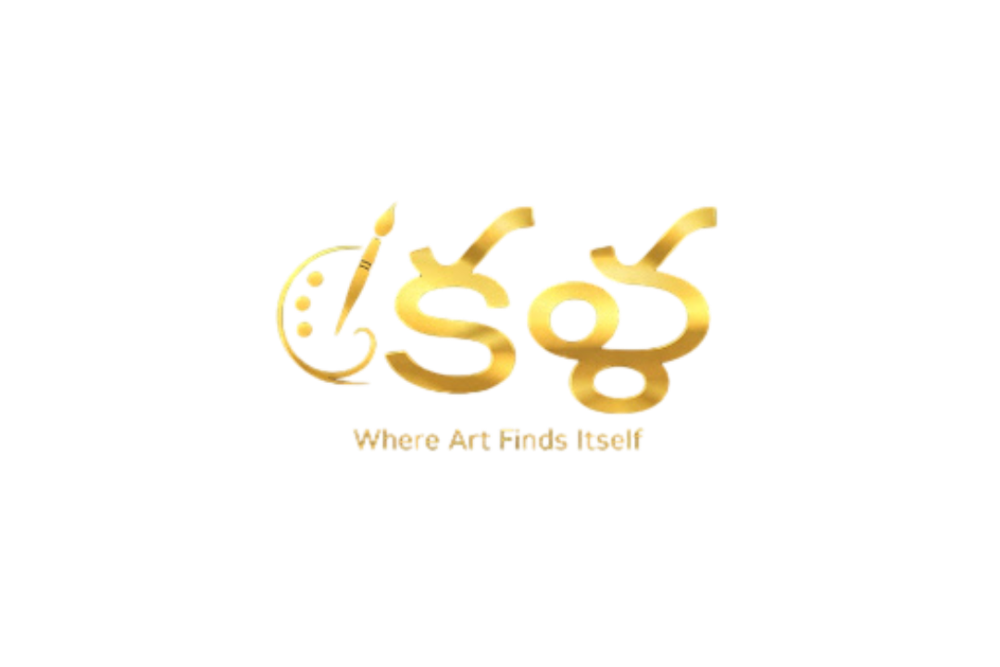

# Kala | Where Art Finds Itself 🎨



**Kala** (Sanskrit for "Art") is a sophisticated AI application designed to deconstruct and identify the artistic signatures of history's greatest painters. 

Powered by a fine-tuned **EfficientNetV2** deep learning model, Kala analyzes brushwork, texture, and color palettes to predict the creator of any uploaded artwork with high precision across **50 legendary masters**—from Van Gogh to Dalí.

## 🚀 Live Demo
[Insert your Vercel Link Here]

## ✨ Features
* **Deep Learning Core:** Uses Transfer Learning on EfficientNetV2, trained on a curated dataset of over 8,000 paintings.
* **50-Class Classification:** Capable of distinguishing between complex styles like Surrealism, Impressionism, and Pop Art.
* **Wiki Integration:** Automatically fetches artist biographies and portraits using the Wikipedia API.
* **Museum-Grade UI:** A "Quiet Luxury" aesthetic built with React and Tailwind CSS, featuring dark mode and smooth animations.

## 🛠️ Tech Stack
* **Frontend:** React, TypeScript, Tailwind CSS, Framer Motion
* **Backend:** Python, Flask, Gunicorn
* **AI/ML:** TensorFlow, Keras, NumPy, Pillow
* **Deployment:** Vercel (Frontend) + Render (Backend)

## 🧠 The Model
The brain of Kala is a Convolutional Neural Network (CNN) based on the **EfficientNetV2B0** architecture.
* **Input:** 224x224 RGB Images
* **Preprocessing:** Bicubic resizing and pixel normalization.
* **Accuracy:** Achieved ~85% Top-3 Accuracy on the test set.

## 📦 Installation

### Backend (The Brain)
```bash
cd backend
pip install -r requirements.txt
python app.py
```

### Frontend (The Face)
```bash
npm install
npm run dev
```

## 🎨 Usage
1. Start the backend server (runs on `http://localhost:5000`)
2. Start the frontend development server (runs on `http://localhost:8081`)
3. Upload any artwork image
4. Watch Kala analyze and identify the artistic style!

## 📁 Project Structure
```
kala-art-gallery/
├── backend/
│   ├── app.py                    # Flask API server
│   ├── requirements.txt          # Python dependencies
│   └── class_names.json          # Artist class mappings
├── src/
│   ├── components/               # React components
│   ├── pages/                    # Page components
│   └── index.css                 # Global styles
├── public/
│   ├── data/artists.csv          # Artist metadata
│   └── kala-logo-transparent.png # Logo assets
└── art_artist_classifier.keras   # Trained model (244MB)
```

## 🌟 Key Features Explained

### AI-Powered Classification
Upload any artwork and Kala will:
- Analyze the image using deep learning
- Return top 5 artist predictions with confidence scores
- Provide Wikipedia links for further reading

### Responsive Design
- Fully responsive across all devices
- Custom scrollbar for museum aesthetic
- Smooth animations and transitions
- Dark/Light mode support

### Production Ready
- Clean, optimized codebase
- Environment variable configuration
- CORS enabled for deployment
- Comprehensive error handling

## 📄 License
This project is open source and available under the MIT License.

---

**Built with 🎨 and 💻 by B. Rahul**
